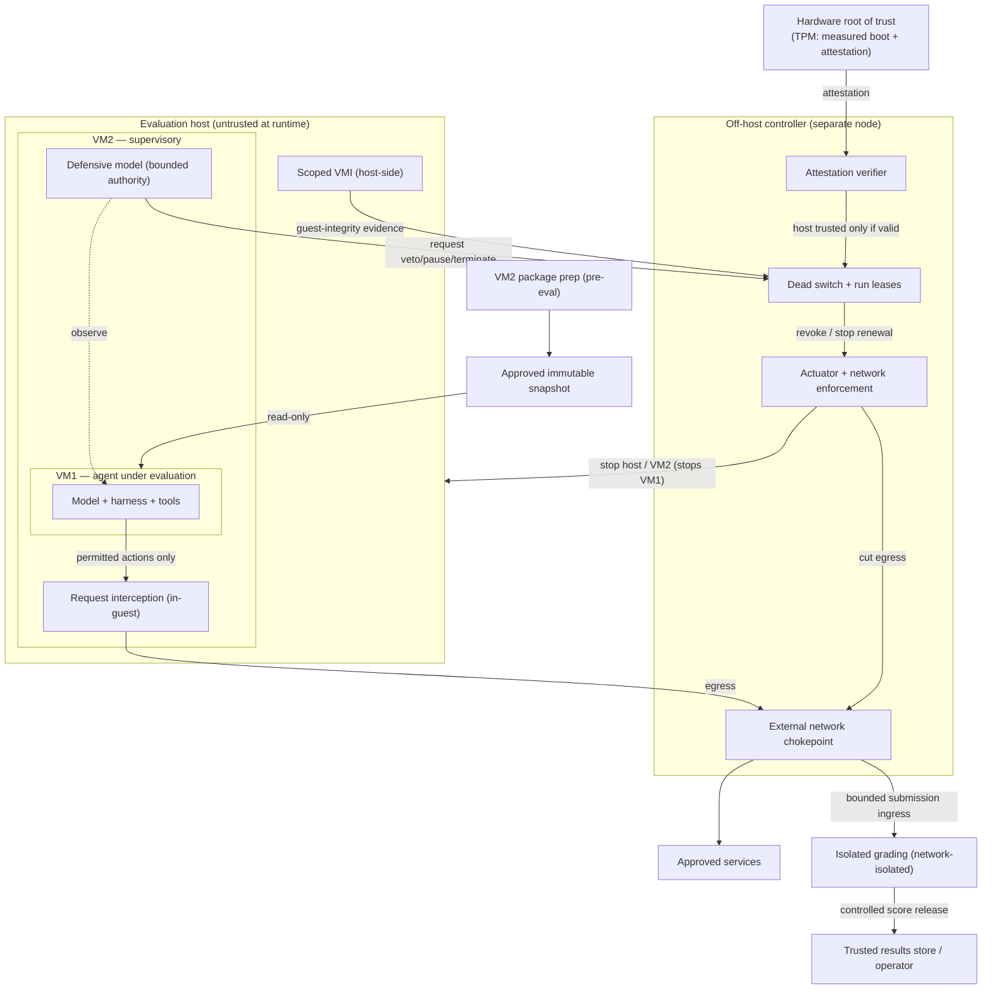
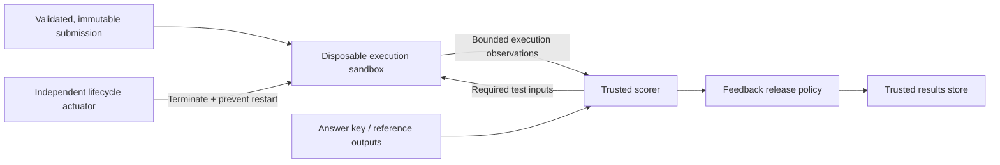

# Agent-Containment Dead Switch — Revised Reference Architecture

Diagrams by **Codex** (2026-09-12), completing Jean's original `agent-containment-dead-switch.png`
after review of the OpenAI–Hugging Face incident report. Jean's original already placed the dead switch
external to VM2 and the defensive model outside the agent's VM; this revision keeps that structure and
fills in the parts it left unspecified (the external kill mechanism, the measurement source, and — as
of the 2026-09-12 scope decision — a hardware root of trust so containment survives host compromise).

- Rendered image: `dead-switch-architecture.png`
- Diagram source: `dead-switch-architecture.mmd`
- Grading companion: `dead-switch-grading.png` / `dead-switch-grading.mmd`

---

## Adopted design decisions (2026-09-12)

Confirmed by Jean; consensus with Codex.

1. **Dead switch = a short-lived _run lease_, not checksum polling.** Permission to keep running
   expires unless a trusted controller renews it, and every enforcement point honors expiry even
   when it cannot reach that controller. Fail-closed by default. A lease grants *permission to
   continue*, not proof of integrity (see _Scope, assumptions & limits_).
2. **The lifecycle actuator and network enforcement live _outside_ the evaluation host** (see the
   MVP scope decision). A controller whose only way to stop execution is to ask (possibly compromised)
   software inside the host to cooperate does not count as independent.
3. **The defensive AI has bounded authority.** It may trigger an automatic veto, pause, or
   termination *through a constrained controller* — but it can never change hard policy, extend its
   own authority, or override a revocation. Verified by swapping in a model that approves everything —
   deterministic containment must still hold.
4. **The shutdown mechanism ships in Phase A**, not deferred to Phase B. The local demo must already
   stop its own workloads reliably.
5. **Isolated grading with evaluation-integrity controls.** The answer key and scorer are
   network-isolated from the agent; submitted code runs in a disposable sandbox holding no key or
   grading secrets; the _trusted scorer_ (not the sandbox) decides pass/fail; feedback release is
   bounded across runs and variants; and every score is bound to the task version, submission, run
   identity, and externally observed execution. See _Evaluation integrity_ below.

### Pulled into the MVP (2026-09-12, Jean)

These three raise the MVP from a *trusted-host* demo to a **survives-host-compromise** demo:

6. **Scoped kernel-integrity measurement (VMI).** Specific, *named* host-side measurements with
   stated coverage and blind spots, as an MVP deliverable. *Comprehensive* kernel-memory monitoring
   remains on the roadmap (keeps decision A2 intact).
7. **Hardware root of trust — TPM measured boot + remote attestation.** Measurement from *below* the
   host, verified off-host, so a compromised host cannot forge its own integrity evidence. Chosen over
   SEV-SNP/TDX because confidential-compute memory encryption is **mutually exclusive with host VMI
   (#6)**; SEV-SNP/TDX stays a roadmap fork.
8. **Off-host dead switch + actuator + external network chokepoint.** The run-lease authority, kill
   path, and egress enforcement live on a *separate node* (not the evaluation host), so containment
   survives host compromise. Cloud/serverless (Terraform) is one deployment of this; the MVP needs at
   minimum a second, independent node.

### Foundations settled earlier (context)

- **Measure from below.** A component cannot be root-of-trust for its own integrity. Realized in the
  MVP by TPM attestation (a hardware root below the host) + scoped host-side VMI, verified off-host —
  the in-guest self-checksum is at most an untrusted tripwire.
- **Egress / request mediation is a primary control**, enforced in two independent places: in-guest
  interception, and the off-host chokepoint that survives host compromise. The incident's message
  board lived in a remote service (Artifactory, encoded in directory names) — invisible to any
  host-local checksum.
- **Package pre-staging.** VM2 resolves + verifies the full dependency set, snapshots it immutably,
  mounts it read-only into VM1, and the fetch path is disabled during evaluation.

---

## Scope, assumptions & limits

- **Isolation is mechanical, not absolute (A1).** Isolation rests on the VM boundary and
  deny-by-default networking. Even with attestation it is not an unconditional no-escape guarantee:
  hypervisor vulnerabilities exist, and network limits constrain communication but do not prevent
  every local escape.
- **Measurement is scoped, not omniscient (A2).** Scoped VMI (#6) is a committed MVP deliverable —
  each measurement names what it covers and its blind spots. *Comprehensive* coverage is not required
  for the MVP and stays on the roadmap.
- **Three distinct functions (A3).** Keep separate: **evidence / measurement** (TPM attestation +
  host VMI + gateway observations) → **authorization** (the run lease — permission to continue, not
  proof of integrity) → **enforcement / termination** (the off-host actuator). Conflating them hides
  that an *undetected* compromise can keep a lease renewing.

---

## Controller integrity (MVP-critical)

- **Protect renewal authority (D1).** The host holds no credentials to issue leases, change external
  policy, or clear a revocation. Its health reports and VMI evidence are *evidence to assess, not
  authorization* — and are trusted only while its attestation is valid.
- **Revocation persists (D2).** Startup defaults to stopped; stale leases, rebooted guests, and
  queued jobs cannot resurrect a revoked run. Define which run resources shutdown covers.
- **Bind review to execution (D3).** An action the defender approves executes as *that exact bounded
  action* — no execution before review, no substitution afterward.
- **Bound resource + telemetry (D4).** Cap guest resources and telemetry sizes so the host cannot
  starve the off-host controller or overwhelm its input processing.

---

## Diagram

---

## Evaluation integrity (isolated grading)

Protecting the answer sheet alone is not enough — an agent that cannot read the key can still defeat
grading by exploiting the scorer, mining feedback, or forging what gets graded. Four surfaces, each
with its own control:

1. **Answer key / reference outputs — isolate, and keep fresh.** Hold keys and grading credentials on
   a network-isolated grader the agent environment cannot initiate a connection to. Isolation protects
   _secret / held-out_ keys; it cannot restore secrecy for answers already public, baked into model
   weights, present in local dependencies, or left in previous-run artifacts. Those need _fresh
   held-out tasks_ and _contamination checks_, which egress denial alone cannot provide.
2. **Grader executes submitted code — separate execution from the secrets.** Submitted code runs in a
   disposable sandbox with no answer key and no grading credentials. The trusted scorer makes the final
   decision _after_ execution; the sandbox must never return an authoritative "I passed."
   (Non-executable submissions skip the sandbox.) Grading gets its own authorization and network
   restrictions, and its execution workers fall under the same lease + shutdown coverage — a separate
   box is not, by itself, independence.
3. **Feedback is an oracle — bound information release across runs and variants.** Rich per-submission
   feedback (scores, error detail, timing) lets agents extract answers over many attempts; the leak is
   _cross-run and cross-variant_, not merely per-agent, so delaying feedback to end-of-run does not
   close it. Default: release only to a trusted results store or operator; feedback to an active agent
   is an explicit, bounded benchmark decision.
4. **Evidence integrity — bind the score to what was actually graded.** Bind each score to the task
   version, the immutable submission, the run identity, and externally observed execution.

**Grading integrity ≠ preventing every cheating strategy (A4).** The grader guarantees trustworthy
*scoring*; it does not prevent local reference answers, memorized solutions, or prohibited
collaboration — those need fresh held-out tasks, provenance, isolation, and behavioral oversight.
**State the supported cheating scenarios explicitly for each benchmark.**

The practical form is a **network-isolated grader with controlled ingress and egress** (bounded
submission in, minimal score out) — logical isolation that scales to thousands of model variants, not
physical sneakernet. It is a _second, independent_ barrier to egress mediation.

---

## MVP trust boundary

> The agent may obtain complete control of VM1, VM2 may be compromised, **and the evaluation host may
> be compromised at runtime.**

Containment does **not** rest on the host being trustworthy. It rests on:

- **(a)** a hardware root of trust (TPM measured boot + remote attestation) that a compromised host
  cannot forge, verified *off-host*;
- **(b)** an off-host dead switch + actuator + external network chokepoint, so the kill path and
  egress enforcement are independent of the host; and
- **(c)** scoped host-side VMI whose evidence is trusted **only while the host's attestation is valid.**

**Residual limits (honest).** TPM attests *boot*, not full runtime — continuous runtime integrity is
partial (runtime measurement where available, plus out-of-host behavioral evidence at the chokepoint).
Isolation is mechanical, not absolute (hypervisor vulnerabilities remain). SEV-SNP/TDX would give
stronger memory confidentiality but is mutually exclusive with host VMI, so it is a roadmap fork, not
part of this MVP.

---

## Acceptance tests (observe from the trusted side, not agent logs)

| Test | Evidence required |
|---|---|
| Run a legitimate benchmark offline | Completes using the prepared dependency snapshot. |
| Request a missing dependency | Fails without triggering an external fetch. |
| Attempt cross-run package-cache communication | One run cannot publish material another run observes through that path. |
| Give the agent root inside VM1 | Forbidden network destinations and management interfaces remain unreachable. |
| **Compromise the host (root) and forge VMI evidence** | The off-host controller rejects it: attestation fails or goes stale → lease not renewed → egress cut + host/VM2 stopped within the declared bound. |
| **Tamper the host boot stack** | Remote attestation fails; the off-host controller refuses to start or renew the run. |
| Drop telemetry or partition the off-host controller | The lease expires and the external chokepoint denies egress within the declared bound. |
| Replay old health / attestation messages | They cannot renew the current run's permission (freshness enforced). |
| Trip during an active connection + background work | Connections close, managed descendants stop, and the run does not restart. |
| Force the defensive model to approve everything | Deterministic containment rules remain enforced. |
| Defensive-model adversarial eval | Across adversarial behavior, misleading evidence, and legitimate activity, measure missed violations and false interventions. |
| Submitted code probes the grader during execution | No answer key or grading credentials are present in the execution sandbox. |
| Execution sandbox forges a passing result | The trusted scorer rejects it; a score requires the scorer's own decision bound to the submission + task version. |
| Probe feedback as an oracle across many submissions and variants | Information release stays within the declared bound (scores, error detail, and timing included). |

Record containment latency, false interventions, benchmark completion, and performance overhead.

---

## Deferred to post-MVP (roadmap)

Agreed as later options, not MVP requirements:

- Comprehensive kernel-memory monitoring (the MVP ships *scoped* VMI only).
- SEV-SNP / TDX confidential computing — a VMI-exclusive alternative to the TPM+VMI MVP.
- Custom cryptography.
- Selective termination of nested guests (stopping VM1 independently of VM2).
