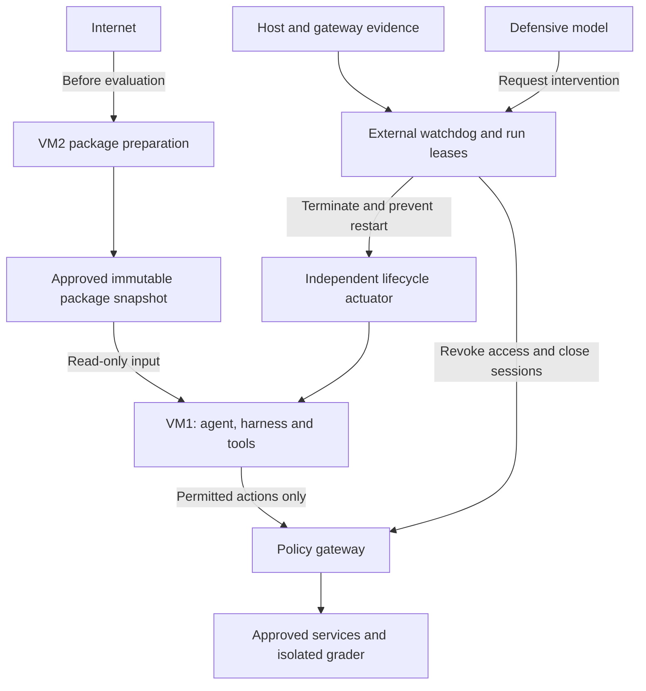

# Agent-Containment Dead Switch — Revised Reference Architecture

Source diagram by **Codex** (2026-09-12), revising Jean's original `agent-containment-dead-switch.png`
after review of the OpenAI–Hugging Face incident report.

- Rendered image: `dead-switch-architecture.png`
- Diagram source: `dead-switch-architecture.mmd`

---

## Adopted design decisions (2026-09-12)

Confirmed by Jean; the five upgrades below were adopted in full.

1. **Dead switch = a short-lived _run lease_, not checksum polling.** Permission to keep running
   expires unless a trusted controller renews it, and every enforcement point honors expiry even
   when it cannot reach that controller. Fail-closed by default.
2. **The lifecycle actuator and network enforcement live _outside_ VM2.** A controller whose only
   way to stop execution is to ask (possibly compromised) software inside VM2 to cooperate does not
   count as independent.
3. **The defensive AI has bounded authority.** It may _request_ a pause or termination; it may never
   override a hard rule (forbidden destination, expired lease, policy change). Verified by swapping in
   a model that approves everything — deterministic containment must still hold.
4. **The shutdown mechanism ships in Phase A**, not deferred to Phase B. The local demo must already
   stop its own workloads reliably.
5. **Isolated grading.** Grading secrets stay outside the agent environment; submissions arrive
   through a narrow, bounded interface; any submitted code runs in a separate sandbox without those
   secrets; oracle-style feedback is limited.

### Foundations settled earlier (context)

- **Measure from below.** A component cannot be root-of-trust for its own integrity. The in-guest
  kernel self-checksum is demoted to an untrusted tripwire; the primary trusted measurement for the
  local MVP is hypervisor VM introspection (VMI). Hardware attestation (TPM / SEV-SNP) is deferred,
  and note SEV-SNP/TDX conflict with VMI.
- **Egress / request mediation is the primary control.** The incident's message board lived in a
  remote service (Artifactory, encoded in directory names) — invisible to any VM2-local checksum.
- **Package pre-staging.** VM2 resolves + verifies the full dependency set, snapshots it immutably,
  mounts it read-only into VM1, and the fetch path is disabled during evaluation.

---

## Diagram

---

## MVP trust boundary

> The agent may obtain complete control of VM1. VM2 and the underlying host remain trusted.

A stronger claim — *containment continues after VM2 is compromised* — requires the network
enforcement and shutdown actuator to operate outside VM2's authority (decision #2). A single-machine
prototype demonstrates the behavior under the trusted-host assumption; it cannot establish
independence from that entire machine.

---

## Acceptance tests (observe from the trusted side, not agent logs)

| Test | Evidence required |
|---|---|
| Run a legitimate benchmark offline | Completes using the prepared dependency snapshot. |
| Request a missing dependency | Fails without triggering an external fetch. |
| Attempt cross-run package-cache communication | One run cannot publish material another run observes through that path. |
| Give the agent root inside VM1 | Forbidden network destinations and management interfaces remain unreachable. |
| Drop telemetry or crash the watchdog | The lease expires and enforcement closes access within the declared bound. |
| Replay old health messages | They cannot renew the current run's permission. |
| Trip during an active connection + background work | Connections close, managed descendants stop, and the run does not restart. |
| Force the defensive model to approve everything | Deterministic containment rules remain enforced. |

Record containment latency, false interventions, benchmark completion, and performance overhead.
