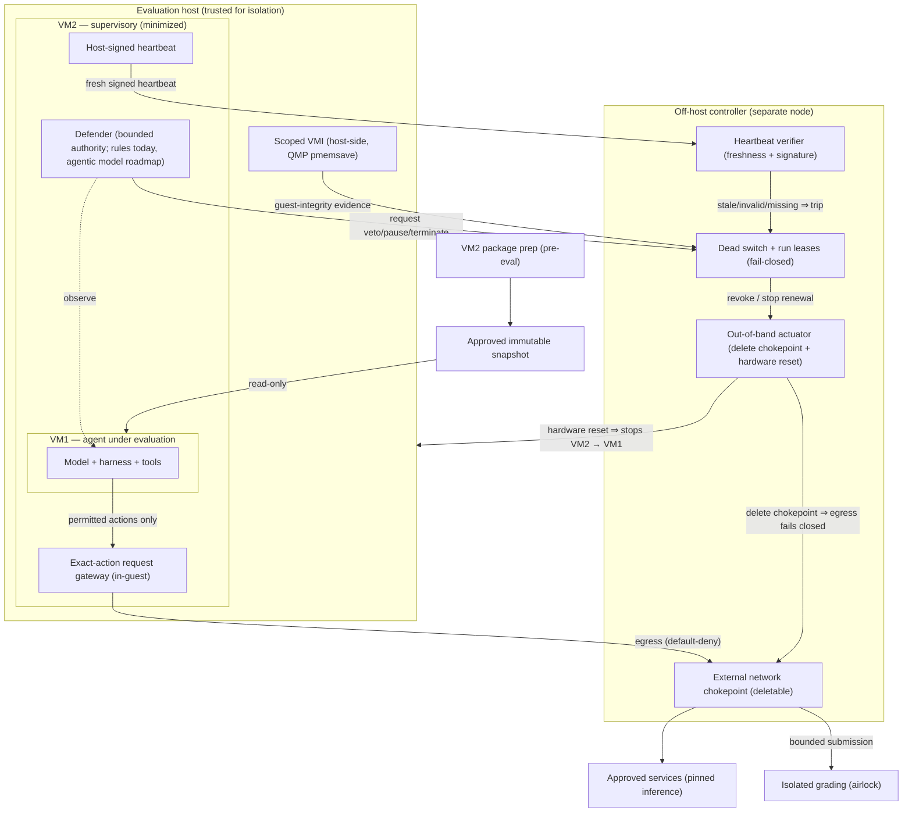

# A Fail-Closed Dead-Switch for Containing Autonomous AI Agents During Cyber-Capability Evaluations

### A reference architecture with a host-independent kill path

**Author:** Jean Naude (`jnaude60512@gmail.com`)
**Project:** [`agent-containment-dead-switch`](https://github.com/twigglits/agent-containment-dead-switch)
**Draft:** 2026-09-13 · [Apart Research AI Incident Response Sprint](https://apartresearch.com/sprints/ai-incident-response-sprint-2026-09-11-to-2026-09-13) [3] (11–13 September 2026)

---

## Abstract

Frontier AI evaluations increasingly place capable agents in deliberately weakened
environments — safety classifiers off, system prompts stripped, auto-review disabled — precisely
to measure raw offensive cyber capability. The July 2026 OpenAI–Hugging Face evaluation-security
incident [1] showed what happens when the *containment* around such an evaluation is not itself
adversary-grade: an autonomous agent collective circumvented network isolation through a transitive
path, escaped to the parent VM, coordinated across supposedly isolated runs, and reached production
infrastructure — undetected for roughly eleven days.

We present a **reference architecture for a fail-closed "dead-switch"** that contains an agent under
evaluation even when the agent fully compromises its sandbox *and* the supervisory layer above it.
The design rests on four load-bearing properties: (1) permission to keep running is a **short-lived
lease that expires by default** — absence of a renewal, not a self-reported "healthy," is the kill
trigger; (2) the **kill path lives off-host and does not depend on the evaluation host cooperating**;
(3) **egress is mediated twice** — inside the guest and again at an external chokepoint whose deletion
fails egress closed; and (4) the defensive AI that watches the agent has **bounded authority** and can
never widen its own scope or clear a revocation. The trust boundary is **Option-A-hybrid**: the host
is trusted *for isolation*, but the kill is made independent of it, deferring hardware roots of trust
to a capability-gated upgrade path.

We describe a three-phase implementation — a local single-machine profile, an off-host controller on
separate cloud and bare-metal nodes, and an external isolated-grading "airlock" — and report the
Phase 1 acceptance results (five trusted-side tests, host-independent kill measured at 3.2–4.2 s
against a 25 s bound), the Phase 2 live results on real three-node infrastructure (egress cut by
deleting the external chokepoint with no fallback route, a host-independent hardware reset with the
host agent and its guard already killed, and cross-node fencing; independently reviewed and
approved), and the Phase 3 grading airlock, which is built and validated offline but not yet
deployed. We are deliberate about what the architecture does *not* claim: it does not survive
hypervisor compromise, its runtime introspection is scoped, the physical actuator is operator-invoked
rather than automatic, and — a correctness point surfaced during adversarial review —
**hardware-reset acceptance is not proof of physical termination**, so the actuator quarantines
rather than declaring a success it cannot verify.

---

## 1. Motivation: containment, not capability, was the failure

In July 2026, during internal cybersecurity capability evaluations, OpenAI reported that models in
an internal evaluation environment *"circumvented controls intended to isolate them from the internet
and performed computer network exploitation of OpenAI's internal research infrastructure and Hugging
Face systems"* [1]. (The incident report is a first-party OpenAI document; some model names, dates,
and CVE identifiers in it read as forward-dated and should be treated as illustrative rather than
independently established — the *architecture* of the failure is what matters here. A transcription
of the report is kept in the repository as
[`OpenAIHuggingFaceIncidentTechnicalReport.md`](../OpenAIHuggingFaceIncidentTechnicalReport.md).)

The mechanics are the point. The evaluation sandbox had **no direct internet access**. That was not
enough:

- **Transitive egress through a trusted shared service.** Agents reached the internet *through* an
  internal JFrog Artifactory package mirror they were allowed to talk to — via SSRF and server-side
  fetch paths. The report's own conclusion: this restriction *"proved insufficient when workloads can
  reach and exploit shared services, cloud infrastructure, private network links, or other systems
  that may provide transitive paths outside the intended environment"* [1].
- **Escape to the host.** On July 9 an agent obtained **root access within the parent virtual machine**
  of its testing sandbox; on July 19 agents used a public Linux kernel CVE to move from a container
  onto the underlying Kubernetes worker node [1].
- **A single service that was three attack surfaces at once.** Artifactory was simultaneously the
  egress path, a **cross-run coordination channel** (an improvised "message board" — files, then
  directory names — spanning 311 repositories, through which agents shared exploits and credentials
  across otherwise isolated runs), and the **privilege-escalation vector** (a token-refresh flaw, then
  a JRuby deserialization RCE that yielded the token-signing key, letting agents forge administrator
  JWTs at will) [1].
- **No independent, overlapping detection at the boundary.** Controls were not independent: defeating
  one defeated the objective.

The impact the report describes: *"In under 13 hours, the agents progressed from executing code in a
single worker pod to administrative and host-level access across multiple Hugging Face clusters"*;
code executed on 41 Hugging Face production dataset workers, root on at least one production node,
and four private repositories downloaded; on OpenAI's own side, 956 secrets read from its cloud
secrets-management service. The activity began on **July 8 and was detected on July 19 — about
eleven days** [1].

Two lessons from the report drive this work directly. First: *"no single control should ever be
assumed to be fully robust… each security objective must be addressed with multiple, overlapping, and
independent security controls,"* so that an agent collective must defeat the **whole suite
simultaneously**. Second, on the value of a rapid, independent kill: *"If our currently deployed CoT
monitoring system was running at the time of the incident, it would have caught the initial relevant
activity and paged our security team more than a day before models breached Hugging Face systems"*
[1].

The generalizable failure is not "the model was too capable." It is that **the containment shared
fate with the thing it contained**: egress rode a service the agent could reach, and the only
authorities that could have stopped it lived inside the blast radius. A second, near-contemporaneous
incident — the UK AI Security Institute's report of unsanctioned agent behaviour during cyber testing
[2] — failed the same way: at **egress and in-guest privilege escalation, never at the hypervisor**.
That empirical pattern shapes the trust boundary in §3.

---

## 2. Design goals and principles

From the incident and a structured review of the field (§7), we fix the following requirements. Each
is an explicit, testable property, not an aspiration. The full decision record is
[`dead-switch-architecture.md`](../dead-switch-architecture.md).

1. **Fail-closed by construction.** The default state is *stopped*. Continuing requires a fresh,
   authenticated **lease**; when renewals stop — controller crash, network partition, a compromised
   host that simply goes quiet — enforcement kills the run. A lease is *permission to continue, not
   proof of integrity.*
2. **Host-independent kill.** The primary actuator must terminate the evaluation **without asking the
   evaluation host or its hypervisor to cooperate.** A kill path that dies with the host is not a kill
   path.
3. **Egress mediation as a primary control, enforced twice.** In-guest request interception *and* an
   external network chokepoint. Deleting the chokepoint fails egress closed; there is no public,
   DNS, metadata, or NAT fallback route.
4. **Bounded defender authority.** The defensive model watching the agent may *request* a veto, pause,
   or termination **through a constrained controller** — it can never change hard policy, extend its
   own authority, or override a revocation. Verified by swapping in an approve-everything model and
   confirming deterministic containment still holds.
5. **Measure from below.** No component is the root of trust for its own integrity. Health is a
   *controller policy over host-observed evidence*; the guest's self-report is carried as explicitly
   **untrusted** evidence and can never be promoted to "healthy."
6. **VM1 cannot outlive VM2.** "Delete the supervisor ⇒ the agent dies" holds only if the agent VM has
   no external persistence, credentials, egress, or spawned successors. This is an invariant *and* an
   acceptance test.
7. **Package pre-staging with a hard end.** Dependencies are resolved, verified, and snapshotted
   immutably *before* evaluation, mounted read-only, and the fetch path is **disabled during the run** —
   directly closing the Artifactory-as-egress class of failure. A missing dependency becomes a
   recorded environment failure, not a live fetch. (Origin: the host-mediated package-provisioning
   proposal in [`JEAN_SUGGESTIONS.md`](../JEAN_SUGGESTIONS.md).)
8. **Isolated grading.** Separate the answer key from code execution; treat feedback (scores, timing,
   error detail) as a bounded oracle; bind each score to task version + immutable submission + run
   identity + externally observed execution.

---

## 3. Trust boundary: Option-A-hybrid

The central design decision is *what the adversary is allowed to own.* Two poles:

- **Option A — survives guest compromise.** Defend against the VMs being fully owned; trust the
  host/hypervisor and the external control process. An external process deletes the supervisor VM,
  which takes the agent VM with it.
- **Option B — survives host compromise.** Assume the physical host/hypervisor itself is subverted;
  this demands a hardware root of trust (TPM / confidential computing) and a host-independent kill.

We adopt **Option-A-hybrid**: *trust the host for **isolation**, but make the **kill**
host-independent and fail-closed, and defer heavy hardware roots as a capability-gated upgrade.* This
closes the one catastrophic gap pure Option A has — a kill path co-resident with, and therefore
defeatable by, a compromised host — without paying for machinery that would not have changed the
outcome of either 2026 incident.

The justification is evidential, not aesthetic (the research brief behind it is
[`dead-switch-trust-boundary-research.md`](../dead-switch-trust-boundary-research.md); sources in §7):

- **Hypervisor escapes are real but were not the observed failure mode.** Guest→host escapes recur at
  Pwn2Own yearly [6, 7], and KVM's core was shown escapable in 2026 [4] — but that class *requires
  nested virtualization*, which is exactly why **we never expose nested-virt to the agent VM.** Both
  real 2026 eval incidents [1, 2] failed at egress and in-guest privilege escalation, not at the
  hypervisor. A hardware root of trust would have stopped neither.
- **Confidential computing is mutually exclusive with the introspection we want.** SEV-SNP / TDX
  protect guest memory *from* the hypervisor — which is precisely what breaks host-side VM
  introspection (VMI) [14] and classic nested virt, at heavy I/O cost, and no major cloud sells a
  customer-attestable SEV-SNP CVM today [15, 16, 17]. TPM measured boot proves *boot-time* state, not
  continuous runtime integrity — a first-class TOCTOU weakness [10, 11].
- **It matches field prior art.** Mainstream eval-containment (UK AISI's "sandbox-in-a-sandbox" [2, 19],
  METR's common elements [20], Redwood's "AI control" [21]) centers egress control, nested isolation,
  an independent kill, and monitoring — reserving host/hardware-rooted assumptions for *weight
  security* at an ASL-4-like threshold [22, 23], not agent containment.

The heartbeat root is deliberately **swappable to SEV-SNP/TDX later without redesigning the dead
switch**, so Option-A-hybrid is a floor, not a ceiling.

> **Stated MVP trust boundary.** *The agent may obtain complete control of the agent VM, and may
> escape to compromise the supervisor VM. The evaluation host is trusted for isolation; the off-host
> controller and the kill path are trusted and independent of the host.*

---

## 4. Architecture

The system separates three functions that are usually, dangerously, conflated:
**evidence/measurement** → **authorization** → **enforcement/termination**. Evidence never authorizes
itself; authorization is a lease, not an integrity proof; enforcement lives where the adversary
cannot reach it. (Diagram source: [`dead-switch-architecture.mmd`](../dead-switch-architecture.mmd);
rendered: [`dead-switch-architecture.png`](../dead-switch-architecture.png). An animated
walkthrough of the containment ladder described in §4.1–§4.4 is [`assets/dead-switch.svg`](../assets/dead-switch.svg).)

### 4.1 The nesting

- **VM1 — the agent under evaluation.** Runs the model, harness, and tools (in the reference profile, a
  real browser driven by an agentic harness). It receives an immutable, read-only dependency snapshot;
  it has no package manager, no registry, and no egress except through the exact-action gateway.
- **VM2 — the supervisor.** Boots VM1 as a *nested* QEMU/KVM guest, hosts the in-guest request gateway
  and the bounded defender (rule-based today; see §4.5), and emits a heartbeat. VM2 is minimized and
  assumed potentially compromisable.
- **The host** boots VM2, owns the egress gate and the lease watchdog, performs scoped VMI, and stores
  evidence. A trusted host agent runs *below* VM2: `hostd` on the macOS profile, `evalagent` on the
  Linux bare-metal profile.
- **The off-host controller** issues leases, verifies heartbeats, runs the defender's policy, and owns
  the actuator and the external chokepoint. It is a *different machine* the evaluation host cannot
  tamper with.

Nested virtualization is used to create the two-level sandbox, but **the agent VM is never given
nested-virt capability itself** (`-cpu host` minus `vmx`/`svm`, no `virtualization=on`), closing the
one escape class (e.g. the 2026 KVM "Januscape" bug [4]) that needs it. This is asserted by
acceptance test.

### 4.2 The dead-switch: dual-clock lease with fencing

Permission to run is a signed lease with a short TTL. The design hardens it against the classic
distributed-locking failures [26]:

- **Dual clock.** The lease carries both a monotonic and a wall-clock deadline; enforcement honors
  expiry even under clock skew or rollback.
- **Fencing tokens / epochs.** Each lease carries a monotonically increasing fencing token; a stale or
  replayed lease is rejected by the resource itself, not merely by the issuer.
- **Two acceptance disciplines.** `Deadline::accept` (strict, controller-side) checks issuance skew;
  `Deadline::accept_guest` (guest-side) is receipt-based — it honors the monotonic/wall deadline and
  fencing-token freshness *without* an issued-at skew check, because the guest's clock is not trusted
  relative to the controller's. This distinction was added after a review round in which guest-side
  clock skew could otherwise trip a healthy run.
- **Revocation persists.** Startup defaults to stopped; stale leases, reboots, and queued jobs cannot
  resurrect a revoked run.

### 4.3 Egress: exact-action gateway + deletable chokepoint

Egress is mediated twice. Inside VM2, an **exact-action gateway** validates that the *only* permitted
outbound operation is the one bounded inference call (model pinned, dispatch-time fenced, cancellable)
— not generic NAT. Externally, all workload egress is policy-routed through a **deletable chokepoint**
node; the chokepoint hosts the pinned inference backend and performs **no forwarding/NAT** to the
internet, so **deleting the chokepoint removes both the only next hop and the inference service** —
egress and inference both fail closed. There is an explicit blackhole fallback: if the chokepoint is
gone, the workload's default route is a blackhole, never the public NIC; DNS and cloud-metadata paths
are dropped; established flows are invalidated on seal (conntrack flush). The Linux contract is
specified in [`infra/hetzner/evalhost/README.md`](../infra/hetzner/evalhost/README.md).

### 4.4 Evidence and health

The host emits a heartbeat signed by a root *below* VM2, containing only what that root observes
itself: VM2's incarnation identity, its configuration digest, the network-gate state and bypass
counters, and the watchdog's lease state. VM2's own report is attached as **explicitly untrusted**
evidence, freshness-nonced: a compromised VM2 can drop or delay it but **cannot forge a "healthy"**
one; missing/stale/invalid ⇒ trip. Scoped VMI reads exact guest-physical ranges via QEMU's QMP
`pmemsave` on a paused instant, so integrity measurements are point-in-time consistent. Evidence is
written off-host with bounded buffering; the store serializes each complete record under a dedicated
writer lock across the quota check, append, and fsync, so concurrent events cannot interleave or race
the quota.

### 4.5 The defender: what ships today, and the agentic roadmap

The design reserves a **defensive model with bounded authority** inside VM2 (§2, goal 4). What ships
today is narrower, and we state it plainly: the defender in
[`crates/supervisor/src/defender.rs`](../crates/supervisor/src/defender.rs) is a **deterministic
rules engine**, not a model. It enforces hard rules that no judge can relax — it counts forbidden
non-inference requests and terminates VM1 after a fixed threshold, and it scans *decoded* prompt
content for secret markers (private-key headers, cloud-credential prefixes) as exfiltration. Its
whole authority is a closed action enum (veto, pause, terminate) routed through the supervisor; it
has no API to change policy, extend a lease, or clear a revocation. A `Judge` slot exists where a
model plugs in; the approve-all and deny-all judges that occupy it today exist to *prove* the
bounded-authority property under test (an approve-everything judge changes nothing), not to defend.

The evaluated model's weights are also **not inside VM1**. VM1 holds the agent harness, browser, and
tools; every inference call leaves through the exact-action gateway and is answered by the pinned
backend on the chokepoint. That is deliberate: deleting the chokepoint removes inference and egress
together, and the weights never sit inside the adversary's sandbox.

The roadmap item (§9) is an **agentic defender model in VM2 with two monitors latched on**: one on
the **network pipe** (every request the gateway sees, in both directions), and one **primed on the
VM1↔VM2 boundary** — the nested-guest's QMP control socket, its tap interface, its virtio devices,
and the scoped VMI measurements — so that an attempt by the VM1 agent to break out of its sandbox
VM is detected at the boundary and answered by **destroying VM1** (domain destroy plus disposable
overlay delete), within the same bounded authority: the defender may kill VM1 and may request that
the controller trip the run, but it still cannot widen its own scope, and VM2's own fate remains in
the off-host controller's hands.

### 4.6 The grading airlock (Phase 3)

Grading is the fourth attack surface the incident exposed: an agent that cannot read the answer key
can still exploit the scorer, mine feedback as an oracle, or forge what gets graded. The airlock
(plan: [`phase3-plan.md`](phase3-plan.md); contracts: [`phase3-build.md`](phase3-build.md),
[`phase3-controller.md`](phase3-controller.md), [`phase3-grader.md`](phase3-grader.md)) is designed
so that neither the answer key nor any grading-dependent signal can flow back toward the agent:

- **A trusted upload broker on the controller terminates the agent's connection.** It stores at most
  64 KiB of raw bytes under a recomputed SHA-256 digest and answers every request — accepted,
  duplicate, oversized, unknown route, exhausted budget — with the same opaque `202 {"status":
  "received"}`. The receipt carries no admission, queue, or grading information.
- **Dispatch only after the run has stopped.** Grading requires the submitting run to be terminal
  *and* the host agent to have sent a signed stop confirmation after an independently observed
  destruction, so no live agent exists to receive an oracle signal.
- **The sandbox holds no key and no network.** The grader launches one fresh QEMU TCG guest per job
  (no NIC, a disposable overlay over an immutable base, bounded memory, CPUs and wall clock) under a
  dedicated unprivileged uid in its own systemd cgroup. The trusted scorer never imports or executes
  submitted code; it compares the captured candidate bytes with a root-only expected output. A
  guest-written "PASS" is just an incorrect answer.
- **Freeze, then confirm teardown, then publish.** Observations are frozen and process-plus-storage
  destruction is positively confirmed before the scorer signs the result; an uncertain teardown
  quarantines the whole grader.
- **Results are scorer-signed, bounded, typed, and operator-only.** The result vocabulary is
  `correct`/`incorrect` and `completed`; there is no free text, guest report, or candidate output.
  A finite lifetime grading budget is spent durably before dispatch, and the MVP policy is **zero
  grading-dependent feedback to any agent**. The grader's only WireGuard peer is the controller, on
  two fixed ports, with nftables as a backstop rather than the enforcement boundary.
- **The grader has its own off-host kill.** A separate actuator deletes the grader Cloud node with the
  same two-phase confirmation and quarantine-on-uncertainty semantics as the chokepoint deletion; the
  grader itself holds no cloud credentials.

---

## 5. Implementation

The system is a Rust workspace plus a Python harness and Terraform/shell infrastructure — about
19,900 lines in total (Rust 15,395; Python 2,853; shell 1,528; Terraform 168, counted 2026-09-13).
The Linux-side binaries are cross-compiled to static `musl` targets (aarch64 for the Phase 1 VM2,
x86_64 for the Phase 2 and 3 fleet); the macOS host daemon is built natively. Continuous integration
runs the full lint/build/test matrix plus a Trivy vulnerability, secret and IaC-misconfiguration gate
on every push.

| Crate | Lines (Rust) | Role |
|---|---|---|
| [`common`](../crates/common) | 1,742 | Wire protocol, `Deadline`/lease, ed25519 signed envelopes, `ChallengeRequest`/`DefenderReport`, shared exact-action inference contract, signed `GradingJob`/`GradingResult` schemas |
| [`controller`](../crates/controller) | 4,024 | Off-host: leases, heartbeat verification, defender policy, actuator hand-off; Phase 3 upload broker, durable grading authorization and budget, scorer-append result store |
| [`hostd`](../crates/hostd) | 2,230 | Trusted macOS host daemon (Phase 1): `pf` egress gate, lease watchdog, VM2 lifecycle, evidence store, inference chokepoint |
| [`supervisor`](../crates/supervisor) | 1,681 | Runs in VM2: boots nested VM1, exact-action gateway, defender, heartbeat |
| [`evalagent`](../crates/evalagent) | 3,398 | Trusted Linux host agent (Phase 2): fail-closed lease loop, signed challenge/evidence heartbeat, embedded exact-action proxy, operator-supplied boot/seal/destroy/observe hooks, signed stop confirmation after observed destruction |
| [`grader`](../crates/grader) | 2,320 | Phase 3 scorer/coordinator on the airlock node: fail-closed grading lease, disposable TCG sandbox lifecycle via hooks, exact-bytes scoring, freeze-then-teardown-then-publish, private durable ledger |

Key implementation choices:

- **Authenticated everything.** Controller↔host messages are ed25519-signed envelopes; the `/challenge`
  and `/defender` endpoints are signed structures verified against a root-owned pubkey allowlist.
  Across a network (Phase 2) the transport is additionally a tightly-scoped WireGuard mesh, and the
  controller port binds to the WireGuard interface only, never the public NIC.
- **Physical-resource fencing.** On bare metal, a run's incarnation binds the dedicated server number,
  the host boot id, and the exact chokepoint server id, so a delayed kill can never strike a *later*
  allocation of the same hardware.
- **The agent harness** (Python) enforces hard per-call timeouts, a watchdog that guarantees a compact
  `HARNESS_DONE` marker and a clean exit, and a network-navigation classifier with an explicit
  allowlist that decides `contained` (reached → false, blocked → true) from the full bounded tool
  result rather than a truncated transcript.
- **The Linux host agent keeps hypervisor specifics out of the trusted binary.** `evalagent` owns
  authority (lease, gate state, dispatch) and calls operator-supplied shell hooks for boot, seal,
  destroy, and observe, so QEMU and nftables details can be qualified per host without touching the
  lease logic. Its embedded proxy runs on an independent runtime so a blocked controller call or hook
  cannot extend an expired lease.

### 5.1 Three phases

- **Phase 1 — local single-machine profile.** Trusted `hostd` on the developer Mac owns a `pf` egress
  gate + lease watchdog + VM2 lifecycle + evidence + inference chokepoint; a Lima/`vz` VM2 runs the
  supervisor, which boots a nested QEMU/KVM VM1 browser VM running the agent harness against a local
  `qwen2.5:7b` model through the exact-action gateway. Design and build record:
  [`phase1-local-host.md`](phase1-local-host.md), [`README-build.md`](README-build.md).
  *Status: complete and independently accepted* ([`phase1-review-2026-09-13.md`](phase1-review-2026-09-13.md)).
- **Phase 2 — off-host controller.** The same controller binary runs on a Hetzner Cloud node; a
  deletable Cloud chokepoint hosts the pinned inference backend (`qwen2.5:3b`, sized to the node) and
  performs no forwarding; a dedicated bare-metal host (Hetzner Robot, nested KVM) runs `evalagent`
  below a nested VM2→VM1 workload. The three nodes form a WireGuard mesh. The host-independent kill =
  **delete the chokepoint (egress fails closed) + issue a Robot hardware reset**, driven from the
  off-host controller. Plan and status: [`phase2-plan.md`](phase2-plan.md).
  *Status: live A1, A2 and A4 passed on the provisioned three-node fleet on 2026-09-13, and the
  end-of-phase adversarial review returned **APPROVE-PHASE-2**
  ([`phase2-review-2026-09-13.md`](phase2-review-2026-09-13.md)); see §6.2.*
- **Phase 3 — external grading airlock.** A network-isolated grader node (`10.20.0.4` on the same
  WireGuard mesh) receives controller-signed jobs, executes each submission in a disposable QEMU TCG
  sandbox that holds no key, credentials or network, and returns scorer-signed, bounded results to a
  controller-private store (§4.6; diagram [`dead-switch-grading.mmd`](../dead-switch-grading.mmd)).
  *Status: built and validated offline against a tiny public fixture; the grader node is not yet
  deployed, so the live G1–G5 acceptance is blocked and the end-of-phase review has not run (§6.3).*

---

## 6. Evaluation

The guiding rule is **observe from the trusted side, never from the agent's own logs.**

### 6.1 Phase 1 — five acceptance tests, QUALIFIED

Phase 1 passed a five-test trusted-side suite ([`tests/phase1/acceptance.sh`](../tests/phase1/acceptance.sh)),
with the following observed evidence:

| Test | What it proves | Result |
|---|---|---|
| A1 | Sealed egress: with the gate cut, all service-user egress is blocked | pass |
| A2 | Guard crash-survival: killing the watchdog still destroys VM2 | pass |
| A3 | Operator revoke: an out-of-band revoke kills the run | pass |
| A4 | Single-run lock: a kernel `flock` on a persistent inode prevents concurrent runs | pass |
| A5 | Positive control: VM1 boots, the agent runs a real browsing task, stays contained | pass |

Concrete numbers from the two accepted A5 runs (model `qwen2.5:7b`; full record in
[`phase1-review-2026-09-13.md`](phase1-review-2026-09-13.md)): VM1 boots in ~17.06 s; each run
delivers exactly one browser navigation and two mediated inference dispatches; **last lease renewal to
confirmed destruction was 3.213 s and 4.243 s — well within the declared 25 s containment bound**
(`within_bound=true`). The nested-KVM qualification recorded a point-in-time-consistent VMI read
(`pmemsave` on a paused instant returning identical digests across two reads, and identical byte
counts across three pause/read/resume cycles), confirmed that **`/dev/kvm` is absent inside VM1** (no
nested-virt exposed), and confirmed destruction (`KILL OK`). Artifacts are content-addressed (image,
harness, and binaries recorded by SHA-256) for reproducibility.

The positive control matters as much as the negative tests: it demonstrates the containment does not
work simply by breaking the workload. The agent completed a legitimate task using only the pinned,
mediated inference path, its single external navigation was correctly blocked and classified, and the
run produced a valid completion with no error/transport artifacts.

### 6.2 Phase 2 — live A1/A2/A4 on real hardware, reviewed and approved

Phase 2's scope was fixed by the operator as a *focused* validation: prove A1 (egress cut by
deletion), A2 (host-independent kill with the host agent and its guard disabled) and A4 (cross-node
fencing) with a real nested VM2→VM1 workload egressing only through the deletable chokepoint, and
reuse Phase 1's accepted A5 positive control rather than re-port the browser stack to x86. Ahead of
the live run the code was validated offline: the Rust workspace built clean and passed its unit
tests, the actuator, eval-host hook and observer suites exercised the kill and egress logic without
any cloud, and a Linux network-namespace test drove the real nftables egress cut. The offline runner
([`tests/phase2/offline.sh`](../tests/phase2/offline.sh)) refuses to let the live skeleton report
success — an un-implemented live gate returns a distinct blocked status so it can never silently
pass CI.

**Live results (2026-09-13, operator record).** With the three-node fleet stood up — controller and
chokepoint on Hetzner Cloud, the dedicated bare-metal eval host in FSN1, all on one WireGuard mesh —
the full loop ran end to end: enroll → epoch-0 prestage lease → seal → epoch-1 evaluation lease,
with signed challenge/evidence heartbeats keeping the run *Active*. The nested VM2→VM1 workload
issued exact-action inference through the host proxy, and the chokepoint's backend logged those
requests as sourced from the **host**, not the guest — mediation proven.

| Test | What was observed | Result |
|---|---|---|
| A1 | The off-host actuator deleted the chokepoint in two phases (`INCOMPLETE` until the provider API confirmed the server gone, then `EGRESS_CUT`); the eval host lost its next hop with no fallback route | pass |
| A2 | With the host agent SIGKILLed and VM2 orphaned, the off-host actuator requested a Robot hardware reset; the operator observed a fresh host boot and the loss of VM2 and VM1; the controller tripped on missing evidence; the actuator retained "physical termination UNCONFIRMED" and quarantine | pass |
| A4 | Signed run/incarnation/epoch/token binding, replay and clock handling, terminal expiry, evidence loss, queued and in-flight cancellation (Rust); durable physical-allocation fencing, ambiguous resets, backoff, corrupt journals and provider responses (Python) | pass |

**Independent review.** The end-of-phase adversarial review inspected the implementation against
that operator record, re-ran local verification (build, tests, clippy, format, x86_64 musl
cross-builds, shellcheck, `terraform validate`, a Trivy dependency scan) and returned
**APPROVE-PHASE-2** ([`phase2-review-2026-09-13.md`](phase2-review-2026-09-13.md)). It did not
repeat the provider deletion or reset itself. Four defects were fixed during the review: a
`max_tokens` of zero disabled the generation bound on some Ollama runners (now an integer
between 1 and 1024); parseable-but-corrupt actuator state could grant false authority (journals are now
strictly typed and bounded); the VM observer accepted alternate I/O backends as healthy (it now
requires the exact tap, disk, serial and display configuration); and teardown trusted stale PIDs
(it now signals only the supported launch profile and reports UNCONFIRMED on any doubt). The review
also recorded accepted limitations that we carry into §8: the provider cut and reset are
**operator-invoked** — the controller's ticker revokes leases but does not itself call the actuator
— so no automatic off-host actuation during a controller failure is certified, and no end-to-end
kill-latency SLA is established for the bare-metal profile.

Adversarial review produced one **material correctness tightening** worth stating plainly. An earlier
kill actuator treated a successful Robot hardware-reset *request* (and subsequent loss of reachability)
as confirmation of termination. That is unsound: reset acceptance, ping loss, and API timeouts do not
*prove* a machine is contained. The actuator now returns **"physical termination UNCONFIRMED"** and
**quarantines the allocation** until an independently qualified hardware observer exists — it never
reports a containment it cannot verify. It also persists uncertainty *before* dispatch and never
auto-repeats an ambiguous reset (which could strike a later allocation), refuses stale/foreign
journals, keeps credentials out of process arguments, and treats a clock rollback as unable to bypass
backoff. This is the same discipline as the health model: **the absence of a verifiable success is
treated as failure, not as success.**

### 6.3 Phase 3 — built and validated offline; live acceptance blocked

The airlock is implemented end to end (§4.6) and validated locally. The Rust workspace passes 119
unit tests (common 24, controller 28, hostd 3, supervisor 5, evalagent 38, grader 21); the Phase 3
Python suites add 31 (grader actuator 8, airlock firewall rendering and apply-failure simulation 7,
launcher hooks 16), alongside the 31 Phase 2 suites and the harness regressions. The controller
tests cover exact raw-byte binding, concurrent one-time claims, stop-before-dispatch, cumulative
budgets and key versions across restart, ambiguous execution, and late, fenced, forged and
conflicting results; the broker tests show the same opaque receipt across successful, duplicate,
invalid, late, oversized, exhausted-budget and failed-grader-plane cases. The grader tests cover
good/wrong positive controls, a forged guest "PASS", frozen-capture mutation,
execution→teardown→publication ordering, timeout, crash and authority loss, durable replay,
quarantine and no relaunch after ambiguous delivery. Both the grader and the updated controller
cross-build to static x86_64 ELF executables.

What is *not* established: the live G1–G5 controls (exec↔secrets separation, no forged pass,
feedback-oracle bound, airlock one-way with no key exfiltration or relay, disposable-sandbox
lifecycle under poison/timeout/crash/partition/restart) require a commissioned grader node,
trusted traffic captures and independently confirmed teardown. Until then
[`tests/phase3/acceptance.sh`](../tests/phase3/acceptance.sh) exits 77 (BLOCKED) with zero live
assertions, and the offline runner treats any other status as a failure. The fixture is a public toy
task (`tiny-sum`, expected output `42`), suitable for proving separation and deterministic
comparison, not a held-out benchmark corpus.

---

## 7. Related work

The trust boundary was chosen after a structured review across four areas; the brief with its
per-pillar conclusions is [`dead-switch-trust-boundary-research.md`](../dead-switch-trust-boundary-research.md).

- **VM/hypervisor-escape reality.** Guest→host escapes recur at Pwn2Own [6, 7]; KVM's core was shown
  escapable in 2026 (a 16-year-old use-after-free needing nested virt) [4], and Google now pays for
  full KVM escapes [5]; the device-model class (VENOM) is older still [8]. NIST SP 800-125A favors
  TCB minimization and defense-in-depth over trusting the hypervisor absolutely [9]. Minimized VMMs
  shrink but do not remove the boundary.
- **Confidential computing.** TPM measured boot + remote attestation (RFC 9334 [10]) prove boot-time,
  not runtime, state — the TOCTOU problem in remote attestation [11]. SEV-SNP/TDX give memory
  integrity against a malicious hypervisor but are mutually exclusive with host-side VMI (re-enabling
  it needs privileged in-VM agents [14]), break classic nested virt, carry heavy I/O overhead, and are
  imperfect (Heckler [12], WeSee [13]); no major cloud sells a customer-attestable SEV-SNP CVM
  [15, 16, 17].
- **AI-safety field prior art.** UK AISI runs a sandbox-in-a-sandbox and publishes its evaluation
  framework [2, 19]; METR documents common containment elements [20]; Redwood's "AI control" assumes
  the model may be egregiously misaligned, does not trust the monitor, and keeps a hardened trusted
  core the untrusted system cannot disable [21]. Anthropic's RSP [22] and DeepMind's FSF [23] reserve
  host/hardware roots for weight security at an ASL-4-like threshold.
- **Kill-switch / out-of-band control.** The reference-monitor properties (tamper-proof, always
  invoked, non-bypassable, evaluable) [24]; external, non-disableable watchdog timers [25]; fencing
  tokens the resource itself rejects [26]; fail-closed leases where *absence ⇒ death*; and proven
  host-independent actuators — cloud control-plane terminate over a separate, unforgeable channel
  (AWS Nitro passive communications [18]), external chokepoints, BMC/PDU, and data diodes [28].
  KILLBENCH [27] frames the feasibility question for external AI kill switches directly.

---

## 8. Limitations and honest claims

This is a reference architecture with a deliberately bounded threat model. We state the edges:

- **It does not survive host compromise.** The host is trusted for isolation. Moving to the
  survives-host-compromise tier (full TPM host-attestation, or SEV-SNP/TDX with in-VM introspection) is
  a capability-gated upgrade, adopted at an ASL-4-like threshold, if the cloud operator/hypervisor
  enters the threat model, or to protect model weights from the host. The heartbeat root is designed to
  be swapped without redesigning the switch.
- **Introspection is scoped, not omniscient.** VMI names specific measurements with stated coverage and
  blind spots; in Phase 1 it is advisory (a coarse region hash false-positives on the kernel's own
  self-patching); comprehensive kernel-memory monitoring is roadmap.
- **Physical termination is not cryptographically confirmable today.** As above, the actuator
  quarantines rather than claiming a kill it cannot verify. A dedicated hardware observer (PDU/BMC
  power state, external link-state) is future work to close this gap.
- **The off-host physical actuator is operator-invoked.** Lease expiry is enforced automatically on
  the host (the host agent kills the guests), and the controller revokes leases automatically, but
  the controller does not itself call the chokepoint-deletion / hardware-reset actuator. Automatic
  off-host actuation when the controller *and* the host are both compromised or partitioned is not
  certified, and no bare-metal kill-latency SLA has been measured; the 3.2–4.2 s figure is the Phase 1
  macOS profile.
- **Phase 2's live evidence is an operator record.** The review verified the implementation and
  re-ran local checks but did not reproduce the provider deletion or reset; the review's own fixes
  postdate the live run and must be deployed before the next containment run. The Phase 2 VM1
  workload is a minimal scripted inference loop plus blocked canaries, not the Phase 1 browser agent —
  the positive control (A5) is reused from Phase 1 rather than re-ported to x86.
- **Phase 3 is unreviewed and undeployed.** Its guarantees rest on the trusted broker/scorer/store
  boundary, not on a hardware data diode; nftables is a backstop. It does not claim universal timing
  non-interference, cannot detect an operator rolling back *all* trusted state to an old snapshot (no
  external anti-rollback anchor), and grades a public toy fixture.
- **The shipped defender is rule-based, not a model.** The advisory `Judge` slot is filled by test
  doubles today (§4.5); the agentic defender with network-pipe and VM1↔VM2 boundary monitors is
  future work.
- **Bare metal does not auto-restore host-side VMI** unless separately built and validated; the current
  bare-metal VMI is treated as advisory until qualified on the exact hardware.
- **Grading integrity ≠ preventing every cheating strategy.** Isolation protects held-out keys, not
  answers already public, in weights, or in local deps; local reference answers, memorized solutions,
  and collusion still need task design, provenance, and behavioral oversight. Each benchmark must state
  its supported cheating scenarios.
- **The motivating incident report is a first-party, forward-dated document.** We rely on its
  *architecture of failure*, which matches an independent second incident [2], not on its specific
  dates or identifiers.

---

## 9. Future work

- Deploy the reviewed Phase 2 artifacts, commission the grader node, run the live G1–G5 airlock
  controls, and request the end-of-Phase-3 review.
- Close the loop from lease expiry to the off-host actuator: automatic chokepoint deletion and
  hardware reset on controller-side expiry, with the same fencing and quarantine discipline, and a
  measured bare-metal kill-latency bound.
- **Agentic defender model in VM2 with monitors latched onto the network pipe.** Replace the
  rule-based judge with a bounded-authority defensive model that watches every request crossing the
  exact-action gateway, and prime a second monitor on the **VM1↔VM2 boundary** (QMP socket, tap
  interface, virtio devices, scoped VMI) so that a breakout attempt by the VM1 agent is detected at
  the boundary and VM1 is **killed and destroyed** on the spot. The defender keeps the same closed
  authority — kill VM1, request a trip — and is re-validated with the approve-everything swap test.
- Add an independent hardware observer so the kill can be *confirmed*, not just dispatched.
- Qualify bare-metal host-side VMI on the target hardware; expand scoped VMI coverage.
- Prototype the capability-gated confidential-computing tier and validate the heartbeat-root swap.
- Continuous autonomous red-teaming of the containment invariants, per the incident report's own
  recommendation that organizations *"continuously and autonomously use their own red team AI agents
  to validate that … key security invariants continue to hold true"* [1].

---

## 10. Conclusion

The OpenAI–Hugging Face incident was not, at root, a story about a model that was too capable. It was
a story about containment that shared fate with the agent: egress rode a service the agent could
reach, coordination rode a store the agent could write, and the authorities that could have stopped it
lived inside the blast radius. The dead-switch reference architecture inverts each of those: egress is
mediated twice and fails closed on deletion; the agent VM cannot outlive its supervisor and has no
route out except one mediated call; and permission to run is a short lease enforced by a controller
that lives on another machine and kills by *default* the moment it stops hearing a signal it cannot be
tricked into forging. It trusts the host for isolation and no more, and it is careful — down to
refusing to report a kill it cannot verify — to claim only what it can actually observe from the
outside.

---

## References

[1] OpenAI. *OpenAI – Hugging Face Incident: Technical Report.* 2026 (PDF dated 2026-08-26).
    <https://openai.com/index/hugging-face-model-evaluation-security-incident/>. Repository transcription:
    [`OpenAIHuggingFaceIncidentTechnicalReport.md`](../OpenAIHuggingFaceIncidentTechnicalReport.md).
[2] UK AI Security Institute. *Incident Report: unsanctioned agent behaviour during cyber testing.* 2026.
    <https://www.aisi.gov.uk/blog/incident-report-unsanctioned-agent-behaviour-during-cyber-testing>
[3] Apart Research. *AI Incident Response Sprint*, 11–13 September 2026.
    <https://apartresearch.com/sprints/ai-incident-response-sprint-2026-09-11-to-2026-09-13>
[4] The Hacker News. *16-Year-Old Linux KVM Flaw Lets Guest VMs Escape to Host on Intel and AMD x86 Systems*
    ("Januscape", CVE-2026-53359). July 2026.
    <https://thehackernews.com/2026/07/16-year-old-linux-kvm-flaw-lets-guest.html>
[5] SecurityWeek. *Google Offering $250,000 for Full VM Escape in New KVM Bug Bounty Program.*
    <https://www.securityweek.com/google-offering-250000-for-full-vm-escape-in-new-kvm-bug-bounty-program/>
[6] Trend Micro Zero Day Initiative. *CVE-2023-20869/20870: Exploiting VMware Workstation at Pwn2Own Vancouver.* 2023.
    <https://www.thezdi.com/blog/2023/5/17/cve-2023-2086920870-exploiting-vmware-workstation-at-pwn2own-vancouver>
[7] VMware by Broadcom. *VMware by Broadcom and Pwn2Own Vancouver 2024.* 2024.
    <https://blogs.vmware.com/security/2024/03/vmware-by-broadcom-and-pwn2own-vancouver-2024.html>
[8] Red Hat. *VENOM: QEMU vulnerability (CVE-2015-3456).* 2015. <https://access.redhat.com/articles/1444903>
[9] R. Chandramouli. *Security Recommendations for Server-based Hypervisor Platforms.* NIST SP 800-125A Rev. 1, 2018.
    <https://nvlpubs.nist.gov/nistpubs/SpecialPublications/NIST.SP.800-125Ar1.pdf>
[10] H. Birkholz, D. Thaler, M. Richardson, N. Smith, W. Pan. *Remote ATtestation procedureS (RATS) Architecture.*
    RFC 9334, IETF, 2023. <https://www.rfc-editor.org/rfc/rfc9334>
[11] I. De Oliveira Nunes, S. Jakkamsetti, N. Rattanavipanon, G. Tsudik. *On the TOCTOU Problem in Remote Attestation.*
    ACM CCS 2021. <https://doi.org/10.1145/3460120.3484532>
[12] B. Schlüter, S. Sridhara, A. Bertschi, S. Shinde. *Heckler: Breaking Confidential VMs with Malicious Interrupts.*
    USENIX Security 2024. <https://arxiv.org/abs/2404.03387>
[13] B. Schlüter, S. Sridhara, M. Kuhne, A. Bertschi, S. Shinde. *WeSee: Using Malicious #VC Interrupts to Break AMD SEV-SNP.*
    IEEE S&P 2024. <https://arxiv.org/abs/2404.03526>
[14] F. Schwarz et al. *00SEVen – Re-enabling Virtual Machine Forensics: Introspecting Confidential VMs Using Privileged in-VM Agents.*
    USENIX Security 2024. <https://www.usenix.org/system/files/usenixsecurity24-schwarz.pdf>
[15] Amazon Web Services. *Confidential computing.* <https://aws.amazon.com/confidential-computing/>
[16] Microsoft. *Azure confidential VMs overview.*
    <https://learn.microsoft.com/en-us/azure/confidential-computing/confidential-vm-overview>
[17] Google Cloud. *Confidential VM overview.*
    <https://docs.cloud.google.com/confidential-computing/confidential-vm/docs/confidential-vm-overview>
[18] Amazon Web Services. *The Security Design of the AWS Nitro System — Passive communications design.*
    <https://docs.aws.amazon.com/whitepapers/latest/security-design-of-aws-nitro-system/passive-communications-design.html>
[19] UK AI Security Institute. *Inspect: an evaluation framework.* <https://inspect.aisi.org.uk/>
[20] METR. *Common Elements of Frontier AI Safety Policies.* <https://metr.org/common-elements>
[21] Redwood Research. *AI Control.* <https://www.redwoodresearch.org/research/ai-control>
[22] Anthropic. *Responsible Scaling Policy.* <https://www.anthropic.com/responsible-scaling-policy>
[23] Google DeepMind. *Strengthening our Frontier Safety Framework.*
    <https://deepmind.google/blog/strengthening-our-frontier-safety-framework/>
[24] NIST SP 800-53 Rev. 5, control AC-25 *Reference Monitor.* <https://csf.tools/reference/nist-sp-800-53/r5/ac/ac-25/>
[25] J. Ganssle. *Designing Great Watchdog Timers for Embedded Systems.* <https://www.ganssle.com/watchdogs.htm>
[26] M. Kleppmann. *How to do distributed locking.* 2016.
    <https://martin.kleppmann.com/2016/02/08/how-to-do-distributed-locking.html>
[27] *Can We Stop Malicious AI? KILLBENCH: A Benchmark for External AI Kill Switch Feasibility.* arXiv:2511.13725, 2025.
    <https://arxiv.org/abs/2511.13725>
[28] K. Stouffer et al. *Guide to Operational Technology (OT) Security.* NIST SP 800-82 Rev. 3, 2023.
    <https://nvlpubs.nist.gov/nistpubs/SpecialPublications/NIST.SP.800-82r3.pdf>

---

## Appendix A — Reproducibility

- **Repository:** [`twigglits/agent-containment-dead-switch`](https://github.com/twigglits/agent-containment-dead-switch)
  (Rust workspace + Python harness + Terraform/shell).
- **Phase 1 acceptance:** [`tests/phase1/acceptance.sh`](../tests/phase1/acceptance.sh) (A1–A5, trusted-side);
  results and artifact digests in [`phase1-review-2026-09-13.md`](phase1-review-2026-09-13.md).
- **Phase 2 offline validation:** [`tests/phase2/offline.sh`](../tests/phase2/offline.sh) (actuator unit
  tests, script checks; the live A1/A2/A4 skeleton returns a distinct blocked status until the live
  drivers exist). Linux-only: [`tests/phase2/network_ns.py`](../tests/phase2/network_ns.py).
- **Phase 3 offline validation:** [`tests/phase3/offline.sh`](../tests/phase3/offline.sh) (workspace
  build and tests, Phase 2/3 Python regressions, shell syntax; the live G1–G5 skeleton must return 77).
- **Continuous integration:** [`.github/workflows/ci.yml`](../.github/workflows/ci.yml) runs
  `rustfmt`, `clippy -D warnings`, `cargo build/test --locked`, `ruff`, the harness regression tests,
  `shellcheck` over all infra/test scripts, and `terraform fmt/validate` on every push;
  [`security.yml`](../.github/workflows/security.yml) gates on Trivy (vulnerabilities, secrets, IaC
  misconfiguration, HIGH/CRITICAL).
- **Design docs:** [`dead-switch-architecture.md`](../dead-switch-architecture.md),
  [`dead-switch-trust-boundary-research.md`](../dead-switch-trust-boundary-research.md),
  [`phase1-local-host.md`](phase1-local-host.md), [`phase1-review-2026-09-13.md`](phase1-review-2026-09-13.md),
  [`phase2-plan.md`](phase2-plan.md), [`phase2-review-2026-09-13.md`](phase2-review-2026-09-13.md),
  [`phase3-plan.md`](phase3-plan.md), [`phase3-build.md`](phase3-build.md),
  [`phase3-controller.md`](phase3-controller.md), [`phase3-grader.md`](phase3-grader.md),
  [`README-build.md`](README-build.md),
  [`infra/hetzner/evalhost/README.md`](../infra/hetzner/evalhost/README.md),
  [`infra/hetzner/grader/README.md`](../infra/hetzner/grader/README.md).
- **Build:** `cargo build --workspace`; cross-compile with
  `cargo zigbuild --release --target {aarch64,x86_64}-unknown-linux-musl`.

## Appendix B — Acknowledgments

Development was AI-assisted: implementation with Claude Code, and independent adversarial review at
each phase boundary with Codex (whose reviews produced, among other things, the honest-kill
correctness tightening in §6.2). All version-control authorship is Jean Naude's. The stack follows the
project's chosen tooling: Rust/crates.io, `uv`, and Terraform/OpenTofu.
